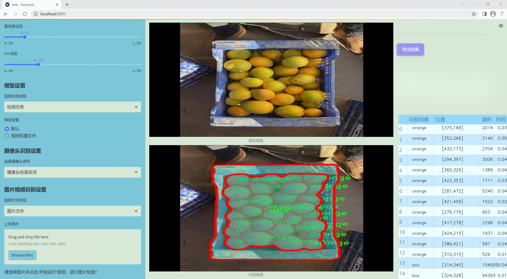
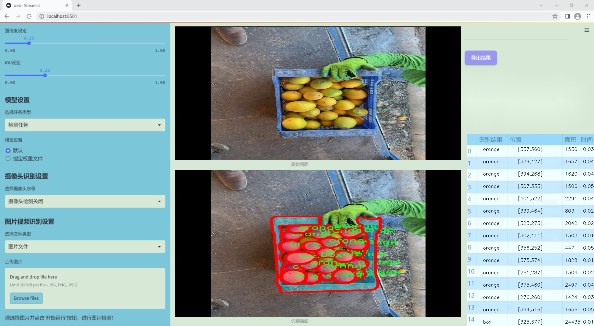
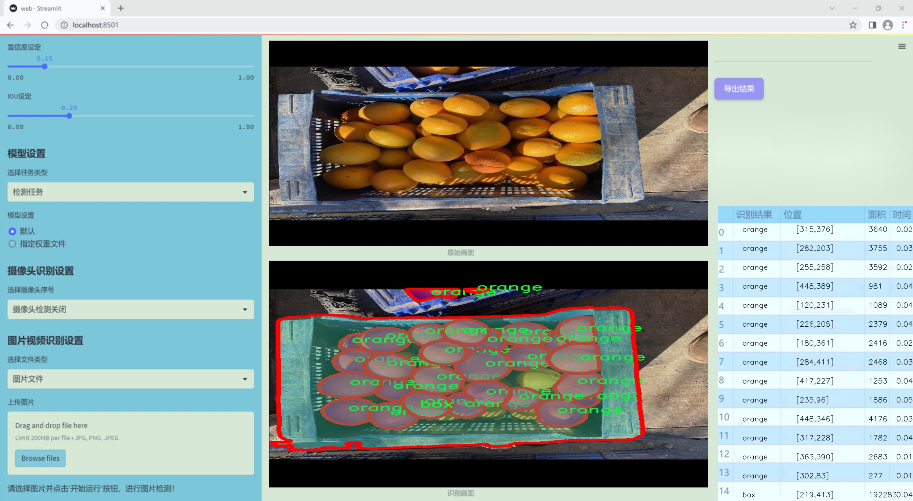
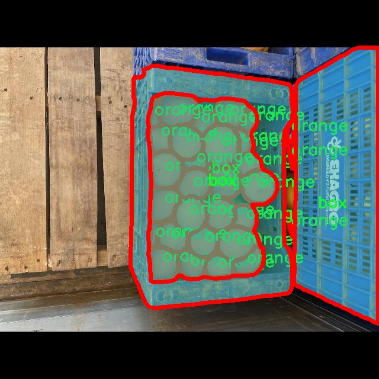
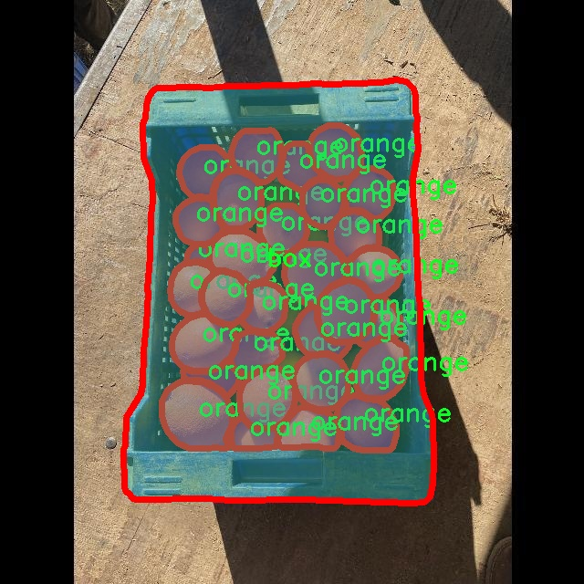
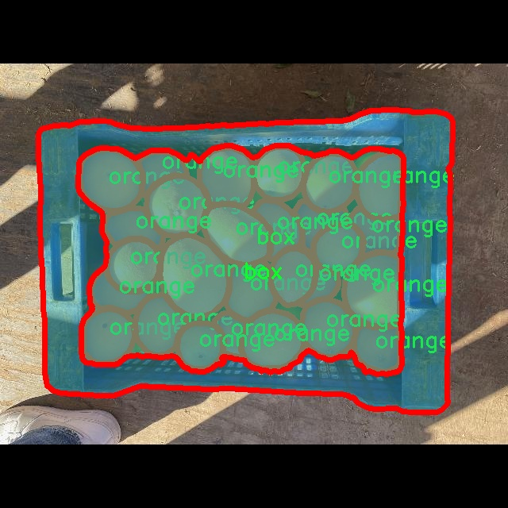
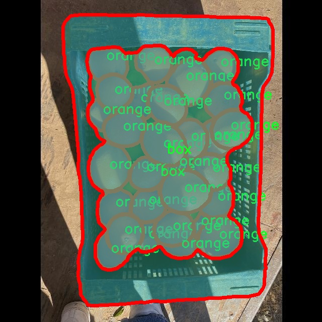
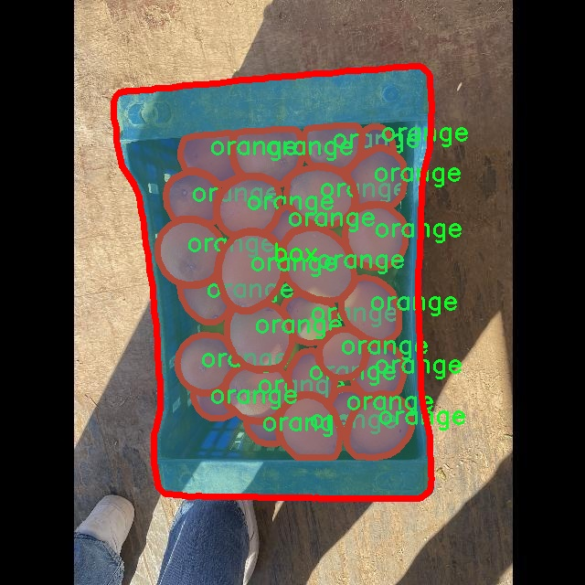

### 1.背景意义

研究背景与意义

随着全球经济的快速发展和人们生活水平的提高，水果消费市场日益繁荣。水果的种类繁多，包装形式也各具特色，如何高效、准确地识别和分割水果及其包装物体，成为了计算机视觉领域的重要研究课题。传统的图像处理方法在复杂场景下往往难以满足实时性和准确性的要求，因此，基于深度学习的目标检测与分割技术逐渐成为研究的热点。

YOLO（You Only Look Once）系列模型因其高效的实时检测能力和良好的准确性，广泛应用于物体检测和分割任务。YOLOv11作为该系列的最新版本，结合了更为先进的网络结构和训练策略，能够在复杂背景下实现对物体的精准识别与分割。针对水果和包装物体的分割任务，改进YOLOv11模型将为提高分割精度和效率提供有力支持。

本研究所使用的OrangeSegmentation数据集包含2500张图像，涵盖了“box”和“orange”两个类别，具备良好的代表性和多样性。通过对该数据集的深入分析与处理，能够有效提升模型在水果与包装物体分割任务中的表现。此外，数据集的标注采用YOLOv8格式，便于与YOLO系列模型的无缝对接，进一步简化了模型训练与测试的流程。

在当前人工智能技术迅猛发展的背景下，基于改进YOLOv11的水果与包装物体分割系统的研究，不仅具有重要的学术价值，也为实际应用提供了切实可行的解决方案。通过该系统的开发与应用，可以为水果的自动化分拣、质量检测及智能包装等领域提供强有力的技术支持，推动相关产业的智能化升级与发展。

### 2.视频效果

[2.1 视频效果](https://www.bilibili.com/video/BV16rrfY5EWx/)

### 3.图片效果







##### [项目涉及的源码数据来源链接](https://kdocs.cn/l/cszuIiCKVNis)**

注意：本项目提供训练的数据集和训练教程,由于版本持续更新,暂不提供权重文件（best.pt）,请按照6.训练教程进行训练后实现上图演示的效果。

### 4.数据集信息

##### 4.1 本项目数据集类别数＆类别名

nc: 2
names: ['box', 'orange']


该项目为【图像分割】数据集，请在【训练教程和Web端加载模型教程（第三步）】这一步的时候按照【图像分割】部分的教程来训练

##### 4.2 本项目数据集信息介绍

本项目数据集信息介绍

本项目所使用的数据集名为“OrangeSegmentation”，旨在为改进YOLOv11的水果与包装物体分割系统提供高质量的训练数据。该数据集专注于两类物体的识别与分割，具体包括“box”（包装箱）和“orange”（橙子）。通过精心设计的数据采集和标注流程，我们确保了数据集的多样性和代表性，以便在实际应用中提高模型的鲁棒性和准确性。

数据集中的图像涵盖了不同的场景和光照条件，展示了橙子与包装箱在各种环境下的外观变化。这种多样性不仅有助于模型学习到不同物体的特征，还能增强其在实际应用中的适应能力。每个图像都经过精确的标注，确保每个物体的边界框和分割区域都能被准确识别。通过这样的标注方式，模型能够更好地理解物体的形状、大小和相对位置，从而实现更高效的分割效果。

在数据集的构建过程中，我们特别关注了样本的均衡性，确保每个类别都有足够的样本量，以避免模型在训练过程中出现偏倚。通过对数据集的精细划分和处理，我们力求为YOLOv11提供一个高质量的训练基础，使其在水果与包装物体的分割任务中表现出色。

总之，“OrangeSegmentation”数据集不仅为本项目提供了必要的训练资源，也为后续的研究和应用奠定了坚实的基础。通过利用这一数据集，我们期望能够推动水果与包装物体分割技术的发展，为相关领域的应用提供更为先进的解决方案。











### 5.全套项目环境部署视频教程（零基础手把手教学）

[5.1 所需软件PyCharm和Anaconda安装教程（第一步）](https://www.bilibili.com/video/BV1BoC1YCEKi/?spm_id_from=333.999.0.0&vd_source=bc9aec86d164b67a7004b996143742dc)


[5.2 安装Python虚拟环境创建和依赖库安装视频教程（第二步）](https://www.bilibili.com/video/BV1ZoC1YCEBw?spm_id_from=333.788.videopod.sections&vd_source=bc9aec86d164b67a7004b996143742dc)

### 6.改进YOLOv11训练教程和Web_UI前端加载模型教程（零基础手把手教学）

[6.1 改进YOLOv11训练教程和Web_UI前端加载模型教程（第三步）](https://www.bilibili.com/video/BV1BoC1YCEhR?spm_id_from=333.788.videopod.sections&vd_source=bc9aec86d164b67a7004b996143742dc)


按照上面的训练视频教程链接加载项目提供的数据集，运行train.py即可开始训练



     Epoch   gpu_mem       box       obj       cls    labels  img_size
     1/200     20.8G   0.01576   0.01955  0.007536        22      1280: 100%|██████████| 849/849 [14:42<00:00,  1.04s/it]
               Class     Images     Labels          P          R     mAP@.5 mAP@.5:.95: 100%|██████████| 213/213 [01:14<00:00,  2.87it/s]
                 all       3395      17314      0.994      0.957      0.0957      0.0843

     Epoch   gpu_mem       box       obj       cls    labels  img_size
     2/200     20.8G   0.01578   0.01923  0.007006        22      1280: 100%|██████████| 849/849 [14:44<00:00,  1.04s/it]
               Class     Images     Labels          P          R     mAP@.5 mAP@.5:.95: 100%|██████████| 213/213 [01:12<00:00,  2.95it/s]
                 all       3395      17314      0.996      0.956      0.0957      0.0845

     Epoch   gpu_mem       box       obj       cls    labels  img_size
     3/200     20.8G   0.01561    0.0191  0.006895        27      1280: 100%|██████████| 849/849 [10:56<00:00,  1.29it/s]
               Class     Images     Labels          P          R     mAP@.5 mAP@.5:.95: 100%|███████   | 187/213 [00:52<00:00,  4.04it/s]
                 all       3395      17314      0.996      0.957      0.0957      0.0845


###### [项目数据集下载链接](https://kdocs.cn/l/cszuIiCKVNis)

### 7.原始YOLOv11算法讲解


其实到了YOLOV11 基本创新点就不太多了，主要就是大家互相排列组合复用不同的网络模块、损失函数和样本匹配策略，需要注意YOLO V5、V8 V11
都是1个公司的，其余的个人建议看看V8的，剩下的了解就好。

V11支持多种视觉任务：物体检测、实例分割、图像分类、姿态估计和定向物体检测（OBB）。

##### YOLOv11
基本和YOLOV8同源，甚至git目前都是1个，部分代码注释还是YOLOV8的，所以建议先看我写的YOLOV8相关博客，对比YOLOV8主要涉及到：

*backbone 中的使用C2f模块 变为 c3k2 模块。

*backbone 中的最后一层（sppf层）后增加了C2PSA模块。

*head 解耦头中的分类检测头两个Conv 变为 DWConv。

整体技术而言：

*backbone 使用了C2K2模块+最后SPPF模块级联C2PSA模块；

*neck 使用PAN结构，并且里面也使用C3K2模块；

*head使用了anchor-free + Decoupled-head，其中回归头使用正常的卷积，分类头使用DWConv；

*损失函数使用了分类BCE、回归CIOU + VFL的组合；

*框匹配策略由静态匹配改为了Task-Aligned Assigner匹配方式；

*训练策略没有提及，其中YOLOV8可以参考如下最后 10 个 epoch 关闭 Mosaic 的操作、训练总 epoch 数从 300 提升到了 500。

##### 主要思路


配置文件：[ultralytics/ultralytics/cfg/models/11/yolo11.yaml at main ·
ultralytics/ultralytics ·
GitHub](https://github.com/ultralytics/ultralytics/blob/main/ultralytics/cfg/models/11/yolo11.yaml
"ultralytics/ultralytics/cfg/models/11/yolo11.yaml at main ·
ultralytics/ultralytics · GitHub")

解析函数：[ultralytics/ultralytics/nn/tasks.py at main · ultralytics/ultralytics ·
GitHub](https://github.com/ultralytics/ultralytics/blob/main/ultralytics/nn/tasks.py#L934
"ultralytics/ultralytics/nn/tasks.py at main · ultralytics/ultralytics ·
GitHub")


##### 具体细节

##### input

输入要求以及预处理，可选项比较多，可以参考这个配置文件：[ultralytics/ultralytics/cfg/default.yaml at main
· ultralytics/ultralytics ·
GitHub](https://github.com/ultralytics/ultralytics/blob/main/ultralytics/cfg/default.yaml
"ultralytics/ultralytics/cfg/default.yaml at main · ultralytics/ultralytics ·
GitHub") 的Hyperparameters 部分。

基础输入仍然为640*640。预处理就是熟悉的letterbox（根据参数配置可以为不同的缩放填充模式，主要用于resize到640）+
转换rgb、chw、int8(0-255)->float（0-1），注意没有归一化操作。需要注意的是作者实现的mosaic和网上看到的不同，对比如下图（左边网上版本，右边是YOLO的实现）。并且作者添加了在最后10轮关闭mosaic增强（YOLOV8开始支持，具体原因个人的经验如我的这篇文章：yolov5
mosaic相关，关闭参数在 Train settings 部分的close_mosaic 选项）


##### backbone

主干网络以及改进

这里不去特意强调对比YOLOv5、V8等等的改进，因为各个系列都在疯狂演进，个人认为没必要花费时间看差异，着重看看一些比较重要的模块即可。源代码：

大多数模块：[ultralytics/ultralytics/nn/modules/block.py at main ·
ultralytics/ultralytics ·
GitHub](https://github.com/ultralytics/ultralytics/blob/main/ultralytics/nn/modules/block.py
"ultralytics/ultralytics/nn/modules/block.py at main · ultralytics/ultralytics
· GitHub")

head 部分：[ultralytics/ultralytics/nn/modules/head.py at main ·
ultralytics/ultralytics ·
GitHub](https://github.com/ultralytics/ultralytics/blob/main/ultralytics/nn/modules/head.py
"ultralytics/ultralytics/nn/modules/head.py at main · ultralytics/ultralytics
· GitHub")

串联模块构造网络：[ultralytics/ultralytics/nn/tasks.py at main ·
ultralytics/ultralytics ·
GitHub](https://github.com/ultralytics/ultralytics/blob/main/ultralytics/nn/tasks.py
"ultralytics/ultralytics/nn/tasks.py at main · ultralytics/ultralytics ·
GitHub")

##### 1）CBS 模块（后面叫做Conv）

就是pytorch 自带的conv + BN +SiLU，这里对应上面的配置文件的Conv 的 args 比如[64, 3, 2] 就是 conv2d
的c2=64、k=3、 s =2、c1 自动为上一层参数、p 为自动计算，真实需要计算scales 里面的with 和 max_channels 缩放系数。

这里连续使用两个3*3卷积stride为2的CBS模块直接横竖各降低了4倍分辨率（整体变为原来1/16）。这个还是比较猛的，敢在如此小的感受野下连续两次仅仅用一层卷积就下采样,当然作为代价它的特征图还是比较厚的分别为16、32。


    
    
        class Conv(nn.Module):
        """Standard convolution with args(ch_in, ch_out, kernel, stride, padding, groups, dilation, activation)."""
    
        default_act = nn.SiLU()  # default activation
    
        def __init__(self, c1, c2, k=1, s=1, p=None, g=1, d=1, act=True):
            """Initialize Conv layer with given arguments including activation."""
            super().__init__()
            self.conv = nn.Conv2d(c1, c2, k, s, autopad(k, p, d), groups=g, dilation=d, bias=False)
            self.bn = nn.BatchNorm2d(c2)
            self.act = self.default_act if act is True else act if isinstance(act, nn.Module) else nn.Identity()
    
        def forward(self, x):
            """Apply convolution, batch normalization and activation to input tensor."""
            return self.act(self.bn(self.conv(x)))
    
        def forward_fuse(self, x):
            """Perform transposed convolution of 2D data."""
            return self.act(self.conv(x))

##### 2）c3k2 模块

##### Bottleneck

有两种结构，需要参数shortcut和两个conv的宽度是否相同来控制。

##### C3 & C3K

都是CSP bottleneck module with 3 convolutions, C3 代表3个卷积层，
K代表其中bottleneck中的卷积核为支持自定义，其实这里c3k作者使用的默认的3*3卷积核也就等同于使用c3(c3是3*3卷积核)。

##### c2f & c3k2

其实也就是仿照YOLOv7 的ELAN
结构，通过更多的分支夸层链接，丰富了模型的梯度流。C3K2模块其实就是C2F模块转变出来的，它代码中有一个设置，就是当c3k这个参数为FALSE的时候，C3K2模块就是C2F模块，也就是说它的Bottleneck是普通的Bottleneck；反之当它为true的时候，将Bottleneck模块替换成C3K模块。模块中存在
Split 等操作对特定硬件部署没有之前那么友好了。需要针对自己的硬件进行测试看对最终推理速度的影响。

可视化关系如下，这里需要注意配置文件中的参数，比如21行[-1, 2, C3k2, [512, False, 0.25]]
512代表宽度、false代表是否使用shortcut、0.25代表c2f的宽度缩放。也就是第一个Conv的输出宽度。


源代码如下:

    
    
    class Bottleneck(nn.Module):
        """Standard bottleneck."""
    
        def __init__(self, c1, c2, shortcut=True, g=1, k=(3, 3), e=0.5):
            """Initializes a standard bottleneck module with optional shortcut connection and configurable parameters."""
            super().__init__()
            c_ = int(c2 * e)  # hidden channels
            self.cv1 = Conv(c1, c_, k[0], 1)
            self.cv2 = Conv(c_, c2, k[1], 1, g=g)
            self.add = shortcut and c1 == c2
    
        def forward(self, x):
            """Applies the YOLO FPN to input data."""
            return x + self.cv2(self.cv1(x)) if self.add else self.cv2(self.cv1(x))
    
    class C3(nn.Module):
        """CSP Bottleneck with 3 convolutions."""
    
        def __init__(self, c1, c2, n=1, shortcut=True, g=1, e=0.5):
            """Initialize the CSP Bottleneck with given channels, number, shortcut, groups, and expansion values."""
            super().__init__()
            c_ = int(c2 * e)  # hidden channels
            self.cv1 = Conv(c1, c_, 1, 1)
            self.cv2 = Conv(c1, c_, 1, 1)
            self.cv3 = Conv(2 * c_, c2, 1)  # optional act=FReLU(c2)
            self.m = nn.Sequential(*(Bottleneck(c_, c_, shortcut, g, k=((1, 1), (3, 3)), e=1.0) for _ in range(n)))
    
        def forward(self, x):
            """Forward pass through the CSP bottleneck with 2 convolutions."""
            return self.cv3(torch.cat((self.m(self.cv1(x)), self.cv2(x)), 1))
    
    class C3k(C3):
        """C3k is a CSP bottleneck module with customizable kernel sizes for feature extraction in neural networks."""
    
        def __init__(self, c1, c2, n=1, shortcut=True, g=1, e=0.5, k=3):
            """Initializes the C3k module with specified channels, number of layers, and configurations."""
            super().__init__(c1, c2, n, shortcut, g, e)
            c_ = int(c2 * e)  # hidden channels
            # self.m = nn.Sequential(*(RepBottleneck(c_, c_, shortcut, g, k=(k, k), e=1.0) for _ in range(n)))
            self.m = nn.Sequential(*(Bottleneck(c_, c_, shortcut, g, k=(k, k), e=1.0) for _ in range(n)))
    
    class C2f(nn.Module):
        """Faster Implementation of CSP Bottleneck with 2 convolutions."""
    
        def __init__(self, c1, c2, n=1, shortcut=False, g=1, e=0.5):
            """Initializes a CSP bottleneck with 2 convolutions and n Bottleneck blocks for faster processing."""
            super().__init__()
            self.c = int(c2 * e)  # hidden channels
            self.cv1 = Conv(c1, 2 * self.c, 1, 1)
            self.cv2 = Conv((2 + n) * self.c, c2, 1)  # optional act=FReLU(c2)
            self.m = nn.ModuleList(Bottleneck(self.c, self.c, shortcut, g, k=((3, 3), (3, 3)), e=1.0) for _ in range(n))
    
        def forward(self, x):
            """Forward pass through C2f layer."""
            y = list(self.cv1(x).chunk(2, 1))
            y.extend(m(y[-1]) for m in self.m)
            return self.cv2(torch.cat(y, 1))
    
        def forward_split(self, x):
            """Forward pass using split() instead of chunk()."""
            y = list(self.cv1(x).split((self.c, self.c), 1))
            y.extend(m(y[-1]) for m in self.m)
            return self.cv2(torch.cat(y, 1))
    
    class C3k2(C2f):
        """Faster Implementation of CSP Bottleneck with 2 convolutions."""
    
        def __init__(self, c1, c2, n=1, c3k=False, e=0.5, g=1, shortcut=True):
            """Initializes the C3k2 module, a faster CSP Bottleneck with 2 convolutions and optional C3k blocks."""
            super().__init__(c1, c2, n, shortcut, g, e)
            self.m = nn.ModuleList(
                C3k(self.c, self.c, 2, shortcut, g) if c3k else Bottleneck(self.c, self.c, shortcut, g) for _ in range(n)
            )

##### 3）sppf 模块

对比spp，将简单的并行max pooling 改为串行+并行的方式。对比如下（左边是SPP，右边是SPPF）：


    
    
        class SPPF(nn.Module):
        # Spatial Pyramid Pooling - Fast (SPPF) layer for YOLOv5 by Glenn Jocher
        def __init__(self, c1, c2, k=5):  # equivalent to SPP(k=(5, 9, 13))
            super().__init__()
            c_ = c1 // 2  # hidden channels
            self.cv1 = Conv(c1, c_, 1, 1)
            self.cv2 = Conv(c_ * 4, c2, 1, 1)
            self.m = nn.MaxPool2d(kernel_size=k, stride=1, padding=k // 2)
    
        def forward(self, x):
            x = self.cv1(x)
            with warnings.catch_warnings():
                warnings.simplefilter('ignore')  # suppress torch 1.9.0 max_pool2d() warning
                y1 = self.m(x)
                y2 = self.m(y1)
                return self.cv2(torch.cat((x, y1, y2, self.m(y2)), 1))

##### 4）C2PSA 模块

C2PSA它结合了PSA(Pointwise Spatial
Attention)块，用于增强特征提取和注意力机制。下面的图建议从左到右看，这样才能更有条理的理解，其实PSA个人感觉就是仿着VIT
的Attention来做的，是把输入C2PSA的特征图的h*w 看做VIT 的path数（也可以理解为NLP中token 个数），特征图的channel
数看做VIT特征维度（CNN的宽度，或者理解为NLP中token
编码后的特征维度），然后计算出QKV（这里需要注意第四幅图的QKV是值，不是操作，所以标注成了圆角矩形，这里是为了大家好理解），这里的Attention其实是在h*w维度计算空间Attention，个人感觉是强制给了全局感受野，并且并联了一个3*3的深度可分离卷积的单空间部分，就是仅在每一个特征图上进行3*3卷积，具体实现是通过pytorch
conv2d 的
group参数设置为特征图的通道数。特别的关于Conv的参数分别为：输入通道数、输出通道数、卷积核尺寸、pad尺寸、group数、是否有激活函数（默认silu）。图中的最后一幅省略了一些细节，可以参考源码。

注意区别C2fPSA，C2fPSA才是对 C2f 模块的扩展，通过在标准 C2f 模块中引入 PSA
块，C2fPSA实现了更强大的注意力机制，从而提高了模型对重要特征的捕捉能力。作者实现了该模块但最终没有使用。


涉及的源码：

    
    
    class Attention(nn.Module):
        """
        Attention module that performs self-attention on the input tensor.
    
        Args:
            dim (int): The input tensor dimension.
            num_heads (int): The number of attention heads.
            attn_ratio (float): The ratio of the attention key dimension to the head dimension.
    
        Attributes:
            num_heads (int): The number of attention heads.
            head_dim (int): The dimension of each attention head.
            key_dim (int): The dimension of the attention key.
            scale (float): The scaling factor for the attention scores.
            qkv (Conv): Convolutional layer for computing the query, key, and value.
            proj (Conv): Convolutional layer for projecting the attended values.
            pe (Conv): Convolutional layer for positional encoding.
        """
    
        def __init__(self, dim, num_heads=8, attn_ratio=0.5):
            """Initializes multi-head attention module with query, key, and value convolutions and positional encoding."""
            super().__init__()
            self.num_heads = num_heads
            self.head_dim = dim // num_heads
            self.key_dim = int(self.head_dim * attn_ratio)
            self.scale = self.key_dim**-0.5
            nh_kd = self.key_dim * num_heads
            h = dim + nh_kd * 2
            self.qkv = Conv(dim, h, 1, act=False)
            self.proj = Conv(dim, dim, 1, act=False)
            self.pe = Conv(dim, dim, 3, 1, g=dim, act=False)
    
        def forward(self, x):
            """
            Forward pass of the Attention module.
    
            Args:
                x (torch.Tensor): The input tensor.
    
            Returns:
                (torch.Tensor): The output tensor after self-attention.
            """
            B, C, H, W = x.shape
            N = H * W
            qkv = self.qkv(x)
            q, k, v = qkv.view(B, self.num_heads, self.key_dim * 2 + self.head_dim, N).split(
                [self.key_dim, self.key_dim, self.head_dim], dim=2
            )
    
            attn = (q.transpose(-2, -1) @ k) * self.scale
            attn = attn.softmax(dim=-1)
            x = (v @ attn.transpose(-2, -1)).view(B, C, H, W) + self.pe(v.reshape(B, C, H, W))
            x = self.proj(x)
            return x
    
    class PSABlock(nn.Module):
        """
        PSABlock class implementing a Position-Sensitive Attention block for neural networks.
    
        This class encapsulates the functionality for applying multi-head attention and feed-forward neural network layers
        with optional shortcut connections.
    
        Attributes:
            attn (Attention): Multi-head attention module.
            ffn (nn.Sequential): Feed-forward neural network module.
            add (bool): Flag indicating whether to add shortcut connections.
    
        Methods:
            forward: Performs a forward pass through the PSABlock, applying attention and feed-forward layers.
    
        Examples:
            Create a PSABlock and perform a forward pass
            >>> psablock = PSABlock(c=128, attn_ratio=0.5, num_heads=4, shortcut=True)
            >>> input_tensor = torch.randn(1, 128, 32, 32)
            >>> output_tensor = psablock(input_tensor)
        """
    
        def __init__(self, c, attn_ratio=0.5, num_heads=4, shortcut=True) -> None:
            """Initializes the PSABlock with attention and feed-forward layers for enhanced feature extraction."""
            super().__init__()
    
            self.attn = Attention(c, attn_ratio=attn_ratio, num_heads=num_heads)
            self.ffn = nn.Sequential(Conv(c, c * 2, 1), Conv(c * 2, c, 1, act=False))
            self.add = shortcut
    
        def forward(self, x):
            """Executes a forward pass through PSABlock, applying attention and feed-forward layers to the input tensor."""
            x = x + self.attn(x) if self.add else self.attn(x)
            x = x + self.ffn(x) if self.add else self.ffn(x)
            return x
        
    class C2PSA(nn.Module):
        """
        C2PSA module with attention mechanism for enhanced feature extraction and processing.
    
        This module implements a convolutional block with attention mechanisms to enhance feature extraction and processing
        capabilities. It includes a series of PSABlock modules for self-attention and feed-forward operations.
    
        Attributes:
            c (int): Number of hidden channels.
            cv1 (Conv): 1x1 convolution layer to reduce the number of input channels to 2*c.
            cv2 (Conv): 1x1 convolution layer to reduce the number of output channels to c.
            m (nn.Sequential): Sequential container of PSABlock modules for attention and feed-forward operations.
    
        Methods:
            forward: Performs a forward pass through the C2PSA module, applying attention and feed-forward operations.
    
        Notes:
            This module essentially is the same as PSA module, but refactored to allow stacking more PSABlock modules.
    
        Examples:
            >>> c2psa = C2PSA(c1=256, c2=256, n=3, e=0.5)
            >>> input_tensor = torch.randn(1, 256, 64, 64)
            >>> output_tensor = c2psa(input_tensor)
        """
    
        def __init__(self, c1, c2, n=1, e=0.5):
            """Initializes the C2PSA module with specified input/output channels, number of layers, and expansion ratio."""
            super().__init__()
            assert c1 == c2
            self.c = int(c1 * e)
            self.cv1 = Conv(c1, 2 * self.c, 1, 1)
            self.cv2 = Conv(2 * self.c, c1, 1)
    
            self.m = nn.Sequential(*(PSABlock(self.c, attn_ratio=0.5, num_heads=self.c // 64) for _ in range(n)))
    
        def forward(self, x):
            """Processes the input tensor 'x' through a series of PSA blocks and returns the transformed tensor."""
            a, b = self.cv1(x).split((self.c, self.c), dim=1)
            b = self.m(b)
            return self.cv2(torch.cat((a, b), 1))

##### 3、neck & head

##### 1）检测头

YOLOV11 Head 部分和YOLOV8是近似的，所以简单对比YOLOV5、V8、V11。


如上面图，上边是YOLOV5 的结构，中是YOLOv8 的结构，下面是YOLOV11 结构

Yolov5: 检测和分类共用一个卷积（coupled head）并且是anchor based ,其 卷积输出为（5+N class）*3，其中
5为bbox 四个值（具体代表什么不同版本略有不同，官方git有说明，历史版本见 目标检测算法——YOLOV5 ）+ 一个obj 值
（是否有目标，这个是从YOLO V1 传承下来的，个人感觉有点绕和不合理，并且后面取消），N class 为类别数，3为anchor 的数量，默认是3个。

YOLOv8：检测和分类的卷积是解耦的（decoupled），如中图，上面一条卷积支路是回归框，框的特征图channel为4*regmax，关于这个regmax
后面我们详细的解释,并不是anchor；分类的channel 为类别数。

YOLOV11：检测和分类的卷积是解耦的（decoupled），如右图，上面一条卷积支路是回归框，框的特征图channel为4*regmax，关于这个regmax
后面我们详细的解释,并不是anchor；分类的channel 为类别数，分类使用深度可分离卷积替代常规卷积降低计算量。

源码部分如下

    
    
    class Detect(nn.Module):
        """YOLO Detect head for detection models."""
    
        dynamic = False  # force grid reconstruction
        export = False  # export mode
        end2end = False  # end2end
        max_det = 300  # max_det
        shape = None
        anchors = torch.empty(0)  # init
        strides = torch.empty(0)  # init
    
        def __init__(self, nc=80, ch=()):
            """Initializes the YOLO detection layer with specified number of classes and channels."""
            super().__init__()
            self.nc = nc  # number of classes
            self.nl = len(ch)  # number of detection layers
            self.reg_max = 16  # DFL channels (ch[0] // 16 to scale 4/8/12/16/20 for n/s/m/l/x)
            self.no = nc + self.reg_max * 4  # number of outputs per anchor
            self.stride = torch.zeros(self.nl)  # strides computed during build
            c2, c3 = max((16, ch[0] // 4, self.reg_max * 4)), max(ch[0], min(self.nc, 100))  # channels
            self.cv2 = nn.ModuleList(
                nn.Sequential(Conv(x, c2, 3), Conv(c2, c2, 3), nn.Conv2d(c2, 4 * self.reg_max, 1)) for x in ch
            )
            self.cv3 = nn.ModuleList(
                nn.Sequential(
                    nn.Sequential(DWConv(x, x, 3), Conv(x, c3, 1)),
                    nn.Sequential(DWConv(c3, c3, 3), Conv(c3, c3, 1)),
                    nn.Conv2d(c3, self.nc, 1),
                )
                for x in ch
            )
            self.dfl = DFL(self.reg_max) if self.reg_max > 1 else nn.Identity()
    
            if self.end2end:
                self.one2one_cv2 = copy.deepcopy(self.cv2)
                self.one2one_cv3 = copy.deepcopy(self.cv3)
    
        def forward(self, x):
            """Concatenates and returns predicted bounding boxes and class probabilities."""
            if self.end2end:
                return self.forward_end2end(x)
    
            for i in range(self.nl):
                x[i] = torch.cat((self.cv2[i](x[i]), self.cv3[i](x[i])), 1)
            if self.training:  # Training path
                return x
            y = self._inference(x)
            return y if self.export else (y, x)

因此主要的变化可以认为有三个：（1）coupled head -> decoupled head ；（2）obj 分支消失；（3）anchor
based——> anchor free ; 4) 深度可分离卷积。

（1）coupled head -> decoupled head

这个解耦操作，看YOLO x 的论文，约有1% 的提升。逻辑和实现都比较直观易懂，不再赘述。

（2）obj 分支消失；

这个其实我自己再看YOLO V1 的时候就有疑问，它存在的意义。后来人们发现，其实obj
的在训练和推理过程中存在逻辑不一致性。具体而言（摘自“<https://zhuanlan.zhihu.com/p/147691786>”）

A。用法不一致。训练的时候，分类和质量估计各自训练自个儿的，但测试的时候却又是乘在一起作为NMS score排序的依据，这个操作显然没有end-to-
end，必然存在一定的gap。（个人认为还好，就是两个监督信号）

B。对象不一致。借助Focal
Loss的力量，分类分支能够使得少量的正样本和大量的负样本一起成功训练，但是质量估计通常就只针对正样本训练。那么，对于one-
stage的检测器而言，在做NMS
score排序的时候，所有的样本都会将分类score和质量预测score相乘用于排序，那么必然会存在一部分分数较低的“负样本”的质量预测是没有在训练过程中有监督信号的，对于大量可能的负样本，他们的质量预测是一个未定义行为。这就很有可能引发这么一个情况：一个分类score相对低的真正的负样本，由于预测了一个不可信的极高的质量score，而导致它可能排到一个真正的正样本（分类score不够高且质量score相对低）的前面。问题一如图所示：


（3）anchor based——> anchor free

这里主要涉及怎么定义回归内容以及如何匹配GT框的问题。也就是如下：

##### 2）匹配策略

A。回归的内容当前版本就是回归的lftp四个值（这四个值是距离匹配到的anchor 点的距离值！不是图片的绝对位置）。后面推理阶段通过
dist2bbox函数转换为需要的格式：

[
https://github.com/ultralytics/ultralytics/blob/cc3c774bde86ffce694d202b7383da6cc1721c1b/ultralytics/nn/modules.py#L378](https://github.com/ultralytics/ultralytics/blob/cc3c774bde86ffce694d202b7383da6cc1721c1b/ultralytics/nn/modules.py#L378
"  
 https://github.com/ultralytics/ultralytics/blob/cc3c774bde86ffce694d202b7383da6cc1721c1b/ultralytics/nn/modules.py#L378")

[
https://github.com/ultralytics/ultralytics/blob/cc3c774bde86ffce694d202b7383da6cc1721c1b/ultralytics/yolo/utils/tal.py#L196](https://github.com/ultralytics/ultralytics/blob/cc3c774bde86ffce694d202b7383da6cc1721c1b/ultralytics/yolo/utils/tal.py#L196
"  
 https://github.com/ultralytics/ultralytics/blob/cc3c774bde86ffce694d202b7383da6cc1721c1b/ultralytics/yolo/utils/tal.py#L196")。

    
    
       def dist2bbox(distance, anchor_points, xywh=True, dim=-1):
        """Transform distance(ltrb) to box(xywh or xyxy)."""
        lt, rb = torch.split(distance, 2, dim)
        x1y1 = anchor_points - lt
        x2y2 = anchor_points + rb
        if xywh:
            c_xy = (x1y1 + x2y2) / 2
            wh = x2y2 - x1y1
            return torch.cat((c_xy, wh), dim)  # xywh bbox
        return torch.cat((x1y1, x2y2), dim)  # xyxy bbox

##### B.匹配策略

YOLOv5 采用静态的匹配策略，V8采用了动态的TaskAlignedAssigner，其余常见的动态匹配还有： YOLOX 的 simOTA、TOOD
的 TaskAlignedAssigner 和 RTMDet 的 DynamicSoftLabelAssigner。


TaskAligned使用分类得分和IoU的高阶组合来衡量Task-Alignment的程度。使用上面公式来对每个实例计算Anchor-level
的对齐程度：s 和 u 分别为分类得分和 IoU 值，α 和 β 为权重超参。t 可以同时控制分类得分和IoU 的优化来实现 Task-
Alignment，可以引导网络动态的关注于高质量的Anchor。采用一种简单的分配规则选择训练样本：对每个实例，选择m个具有最大t值的Anchor作为正样本，选择其余的Anchor作为负样本。然后，通过损失函数(针对分类与定位的对齐而设计的损失函数)进行训练。

代码地址：[ultralytics/ultralytics/yolo/utils/tal.py at
c0c0c138c12699807ff9446f942cb3bd325d670b · ultralytics/ultralytics ·
GitHub](https://github.com/ultralytics/ultralytics/blob/c0c0c138c12699807ff9446f942cb3bd325d670b/ultralytics/yolo/utils/tal.py#L56
"ultralytics/ultralytics/yolo/utils/tal.py at
c0c0c138c12699807ff9446f942cb3bd325d670b · ultralytics/ultralytics · GitHub")

默认参数如下（当前版本这些超参没有提供修改的接口，如需修改需要在源码上进行修改）：


##### 4、loss function

损失函数设计

Loss 计算包括 2 个分支： 分类和回归分支，没有了之前的 objectness 分支。

分类分支依然采用 BCE Loss。回归分支使用了 Distribution Focal Loss（DFL Reg_max默认为16）+ CIoU
Loss。3 个 Loss
采用一定权重比例加权即可（默认如下：<https://github.com/ultralytics/ultralytics/blob/main/ultralytics/yolo/configs/default.yaml#L83>）。


这里重点介绍一下DFL损失。目前被广泛使用的bbox表示可以看作是对bbox方框坐标建模了单一的狄拉克分布。但是在复杂场景中，一些检测对象的边界并非十分明确。如下图左面所示，对于滑板左侧被水花模糊，引起对左边界的预测分布是任意而扁平的，对右边界的预测分布是明确而尖锐的。对于这个问题，有学者提出直接回归一个任意分布来建模边界框，使用softmax实现离散的回归，将狄拉克分布的积分形式推导到一般形式的积分形式来表示边界框。


狄拉克分布可以认为在一个点概率密度为无穷大，其他点概率密度为0，这是一种极端地认为离散的标签时绝对正确的。


因为标签是一个离散的点，如果把标签认为是绝对正确的目标，那么学习出的就是狄拉克分布，概率密度是一条尖锐的竖线。然而真实场景，物体边界并非是十分明确的，因此学习一个宽范围的分布更为合理。我们需要获得的分布虽然不再像狄拉克分布那么极端（只存在标签值），但也应该在标签值附近。因此学者提出Distribution
Focal
Loss损失函数，目的让网络快速聚焦到标签附近的数值，是标签处的概率密度尽量大。思想是使用交叉熵函数，来优化标签y附近左右两个位置的概率，是网络分布聚焦到标签值附近。如下公式。Si
是网络的sigmod 输出（因为真是是多分类，所以是softmax），yi 和 yi+1 是上图的区间顺序，y是label
值。

具体而言，针对我们将DFL的超参数Reg_max 设置为16的情况下：

A。训练阶段：我们以回归left为例：目标的label 转换为ltrb后，y = （ left - 匹配到的anchor 中心点 x 坐标）/
当前的下采样倍数，假设求得3.2。那么i 就应该为3，yi = 3 ,yi+1 = 4。

B。推理阶段：因为没有label，直接将16个格子进行积分（离散变量为求和，也就是期望）结果就是最终的坐标偏移量（再乘以下采样倍数+
匹配到的anchor的对应坐标）


DFL的实现方式其实就是一个卷积：[ultralytics/ultralytics/nn/modules.py at
cc3c774bde86ffce694d202b7383da6cc1721c1b · ultralytics/ultralytics ·
GitHub](https://github.com/ultralytics/ultralytics/blob/cc3c774bde86ffce694d202b7383da6cc1721c1b/ultralytics/nn/modules.py#L67
"ultralytics/ultralytics/nn/modules.py at
cc3c774bde86ffce694d202b7383da6cc1721c1b · ultralytics/ultralytics · GitHub")

NOTE：作者代码中的超参数Reg_max是写死的——16，并且代码内部做了强制截断到16，如果要修改需要修改源码，如果你的输入是640，最大下采样到20*20，那么16是够用的，如果输入没有resize或者超过了640一定要自己设置这个Reg_max参数，否则如果目标尺寸还大，将无法拟合到这个偏移量。
比如1280*1280的图片，目标1280*960，最大下采样32倍，1280/32/2=20 > 16(除以2是因为是一半的偏移量)，超过了dfl
滑板右侧那个图的范围。至于为什么叫focal
loss的变体，有兴趣看一下这个<https://zhuanlan.zhihu.com/p/357415257>和<https://zhuanlan.zhihu.com/p/147691786>就可以，这里不再赘述是因为，如果先看这些，很容易犯晕，反而抓不住DFL
我认为的重点（离散的分布形式）

    
    
        class DFL(nn.Module):
        # Integral module of Distribution Focal Loss (DFL) proposed in Generalized Focal Loss https://ieeexplore.ieee.org/document/9792391
        def __init__(self, c1=16):
            super().__init__()
            self.conv = nn.Conv2d(c1, 1, 1, bias=False).requires_grad_(False)
            x = torch.arange(c1, dtype=torch.float)
            self.conv.weight.data[:] = nn.Parameter(x.view(1, c1, 1, 1))
            self.c1 = c1
    
        def forward(self, x):
            b, c, a = x.shape  # batch, channels, anchors
            return self.conv(x.view(b, 4, self.c1, a).transpose(2, 1).softmax(1)).view(b, 4, a)
            # return self.conv(x.view(b, self.c1, 4, a).softmax(1)).view(b, 4, a)


### 8.200+种全套改进YOLOV11创新点原理讲解

#### 8.1 200+种全套改进YOLOV11创新点原理讲解大全

由于篇幅限制，每个创新点的具体原理讲解就不全部展开，具体见下列网址中的改进模块对应项目的技术原理博客网址【Blog】（创新点均为模块化搭建，原理适配YOLOv5~YOLOv11等各种版本）

[改进模块技术原理博客【Blog】网址链接](https://gitee.com/qunmasj/good)


#### 8.2 精选部分改进YOLOV11创新点原理讲解

###### 这里节选部分改进创新点展开原理讲解(完整的改进原理见上图和[改进模块技术原理博客链接](https://gitee.com/qunmasj/good)【如果此小节的图加载失败可以通过CSDN或者Github搜索该博客的标题访问原始博客，原始博客图片显示正常】
### 全维动态卷积ODConv
鉴于上述讨论，我们的ODConv引入了一种多维注意机制，该机制具有并行策略，用于学习卷积核在核空间的所有四个维度上的不同注意。图提供了CondConv、DyConv和ODConv的示意性比较。

ODConv的公式：根据等式1中的符号，ODConv可定义为


 将注意力标量分配给整个卷积核。图2示出了将这四种类型的关注乘以n个卷积核的过程。原则上，这四种类型的关注是相互补充的，并且以位置、信道、滤波器和核的顺序将它们逐步乘以卷积核 
 ，使得卷积运算不同w.r.t.所有空间位置、所有输入信道、所有滤波器和输入x的所有核，提供捕获丰富上下文线索的性能保证。因此，ODConv可以显著增强CNN基本卷积运算的特征提取能力。此外，具有单个卷积核的ODConv可以与标准CondConv和DyConv竞争或优于它们，为最终模型引入的额外参数大大减少。提供了大量实验来验证这些优点。通过比较等式1和等式2，我们可以清楚地看到，ODConv是一种更广义的动态卷积。此外，当设置n=1且 所有分量均为1时，只关注滤波器方向 的ODConv将减少为：将基于输入特征的SE变量应用于卷积滤波器，然后进行卷积运算（注意原始SE（Hu等人，2018b）基于输出特征，并且用于重新校准输出特征本身）。这种SE变体是ODConv的特例。


图：将ODConv中的四种注意类型逐步乘以卷积核的示例。（a） 沿空间维度的逐位置乘法运算，（b）沿输入信道维度的逐信道乘法运算、（c）沿输出信道维度的按滤波器乘法运算，以及（d）沿卷积核空间的核维度的按核乘法运算。方法部分对符号进行了说明
实现：对于ODConv，一个关键问题是如何计算卷积核的四种关注度 。继CondConv和DyConv之后，我们还使用SE型注意力模块（Hu等人，2018b），但将多个头部作为来计算它们，其结构如图所示。具体而言，首先通过逐通道全局平均池（GAP）运算将输入压缩到具有长度的特征向量中。随后，存在完全连接（FC）层和四个头部分支。ReLU（Krizhevsky等人，2012）位于FC层之后。FC层将压缩特征向量映射到具有缩减比的低维空间（根据消融实验，我们在所有主要实验中设置 ，避免了高模型复杂度）。对于四个头部分支，每个分支都有一个输出大小如图。

### 引入ODConv的改进YOLO
参考这篇博客涵盖了引入ODConv的改进YOLOv11系统的内容，ODConv采用多维注意机制，在卷积核空间的四个维度上学习不同的注意。结合了CondConv和DyConv的优势，ODConv通过图示的四种注意类型逐步与卷积核相乘，以捕获丰富的上下文线索，提升特征提取能力。

#### ODConv结构与方法
ODConv的公式和图示展示了其关注力分配给卷积核的方式，其中四种类型的关注以位置、信道、滤波器和核的顺序逐步与卷积核相乘。这种结构保证了卷积运算不同于标准的Conv操作，能够捕获更多上下文信息，从而增强了CNN的特征提取能力。另外，单个卷积核的ODConv在性能上能够与CondConv和DyConv相竞争，并且引入的额外参数大幅减少。

ODConv的特殊之处在于其广义的动态卷积性质，同时在特定条件下（n=1且所有分量为1），它可以退化为一种特例，即只关注滤波器方向，这类似于基于输入特征的SE变体，但不同于原始SE，它基于输出特征。

#### ODConv的实现
关键问题在于如何计算卷积核的四种关注度。ODConv采用了SE型注意力模块，结合了多个头部来计算这些关注度。具体实现上，通过逐通道全局平均池运算和完全连接层，将输入压缩为特征向量，随后使用四个头部分支来计算四种不同类型的关注。这样的结构能在保持模型复杂度可控的情况下，提升了特征的表征能力。

ODConv的引入为YOLOv11带来了显著的性能提升，并且通过大量实验证明了其在特征提取方面的优越性。其结合了多维注意机制和卷积操作，为目标检测和分拣系统的提升带来了新的思路和性能突破。


### 9.系统功能展示

图9.1.系统支持检测结果表格显示

  图9.2.系统支持置信度和IOU阈值手动调节

  图9.3.系统支持自定义加载权重文件best.pt(需要你通过步骤5中训练获得)

  图9.4.系统支持摄像头实时识别

  图9.5.系统支持图片识别

  图9.6.系统支持视频识别

  图9.7.系统支持识别结果文件自动保存

  图9.8.系统支持Excel导出检测结果数据


### 10. YOLOv11核心改进源码讲解

#### 10.1 kagn_conv.py

以下是对代码的核心部分进行分析和详细注释的结果：

```python
# 引入必要的库
from functools import lru_cache
import torch
import torch.nn as nn
from torch.nn.functional import conv3d, conv2d, conv1d

# 定义 KAGNConvNDLayer 类，作为卷积层的基类
class KAGNConvNDLayer(nn.Module):
    def __init__(self, conv_class, norm_class, conv_w_fun, input_dim, output_dim, degree, kernel_size,
                 groups=1, padding=0, stride=1, dilation=1, dropout: float = 0.0, ndim: int = 2):
        super(KAGNConvNDLayer, self).__init__()
        
        # 初始化参数
        self.inputdim = input_dim  # 输入维度
        self.outdim = output_dim    # 输出维度
        self.degree = degree         # 多项式的度数
        self.kernel_size = kernel_size  # 卷积核大小
        self.padding = padding       # 填充
        self.stride = stride         # 步幅
        self.dilation = dilation     # 膨胀
        self.groups = groups         # 分组卷积的组数
        self.base_activation = nn.SiLU()  # 基础激活函数
        self.conv_w_fun = conv_w_fun  # 卷积权重函数
        self.ndim = ndim             # 数据的维度
        self.dropout = None          # Dropout层

        # 根据维度选择合适的Dropout层
        if dropout > 0:
            if ndim == 1:
                self.dropout = nn.Dropout1d(p=dropout)
            elif ndim == 2:
                self.dropout = nn.Dropout2d(p=dropout)
            elif ndim == 3:
                self.dropout = nn.Dropout3d(p=dropout)

        # 检查参数的有效性
        if groups <= 0:
            raise ValueError('groups must be a positive integer')
        if input_dim % groups != 0:
            raise ValueError('input_dim must be divisible by groups')
        if output_dim % groups != 0:
            raise ValueError('output_dim must be divisible by groups')

        # 创建基础卷积层和归一化层
        self.base_conv = nn.ModuleList([conv_class(input_dim // groups,
                                                   output_dim // groups,
                                                   kernel_size,
                                                   stride,
                                                   padding,
                                                   dilation,
                                                   groups=1,
                                                   bias=False) for _ in range(groups)])

        self.layer_norm = nn.ModuleList([norm_class(output_dim // groups) for _ in range(groups)])

        # 初始化多项式权重
        poly_shape = (groups, output_dim // groups, (input_dim // groups) * (degree + 1)) + tuple(
            kernel_size for _ in range(ndim))

        self.poly_weights = nn.Parameter(torch.randn(*poly_shape))  # 多项式权重
        self.beta_weights = nn.Parameter(torch.zeros(degree + 1, dtype=torch.float32))  # beta权重

        # 使用Kaiming均匀分布初始化权重
        for conv_layer in self.base_conv:
            nn.init.kaiming_uniform_(conv_layer.weight, nonlinearity='linear')

        nn.init.kaiming_uniform_(self.poly_weights, nonlinearity='linear')
        nn.init.normal_(
            self.beta_weights,
            mean=0.0,
            std=1.0 / ((kernel_size ** ndim) * self.inputdim * (self.degree + 1.0)),
        )

    # 计算beta值
    def beta(self, n, m):
        return (
            ((m + n) * (m - n) * n ** 2) / (m ** 2 / (4.0 * n ** 2 - 1.0))
        ) * self.beta_weights[n]

    # 计算Gram多项式
    @lru_cache(maxsize=128)  # 使用缓存避免重复计算
    def gram_poly(self, x, degree):
        p0 = x.new_ones(x.size())  # 初始化p0为全1

        if degree == 0:
            return p0.unsqueeze(-1)

        p1 = x  # p1为输入x
        grams_basis = [p0, p1]  # 存储Gram基

        # 计算高阶Gram多项式
        for i in range(2, degree + 1):
            p2 = x * p1 - self.beta(i - 1, i) * p0  # 递推公式
            grams_basis.append(p2)
            p0, p1 = p1, p2  # 更新p0和p1

        return torch.concatenate(grams_basis, dim=1)  # 连接Gram基

    # 前向传播函数
    def forward_kag(self, x, group_index):
        # 通过基础卷积层和激活函数处理输入
        basis = self.base_conv[group_index](self.base_activation(x))

        # 将x归一化到[-1, 1]范围
        x = torch.tanh(x).contiguous()

        if self.dropout is not None:
            x = self.dropout(x)  # 应用Dropout

        # 计算Gram多项式基
        grams_basis = self.base_activation(self.gram_poly(x, self.degree))

        # 使用卷积权重函数进行卷积操作
        y = self.conv_w_fun(grams_basis, self.poly_weights[group_index],
                            stride=self.stride, dilation=self.dilation,
                            padding=self.padding, groups=1)

        # 通过归一化层和激活函数处理输出
        y = self.base_activation(self.layer_norm[group_index](y + basis))

        return y

    # 主前向传播函数
    def forward(self, x):
        # 将输入x按组分割
        split_x = torch.split(x, self.inputdim // self.groups, dim=1)
        output = []
        for group_ind, _x in enumerate(split_x):
            y = self.forward_kag(_x.clone(), group_ind)  # 对每组调用forward_kag
            output.append(y.clone())
        y = torch.cat(output, dim=1)  # 合并输出
        return y

# 定义3D卷积层
class KAGNConv3DLayer(KAGNConvNDLayer):
    def __init__(self, input_dim, output_dim, kernel_size, degree=3, groups=1, padding=0, stride=1, dilation=1,
                 dropout: float = 0.0):
        super(KAGNConv3DLayer, self).__init__(nn.Conv3d, nn.InstanceNorm3d, conv3d,
                                              input_dim, output_dim,
                                              degree, kernel_size,
                                              groups=groups, padding=padding, stride=stride, dilation=dilation,
                                              ndim=3, dropout=dropout)

# 定义2D卷积层
class KAGNConv2DLayer(KAGNConvNDLayer):
    def __init__(self, input_dim, output_dim, kernel_size, degree=3, groups=1, padding=0, stride=1, dilation=1,
                 dropout: float = 0.0, norm_layer=nn.InstanceNorm2d):
        super(KAGNConv2DLayer, self).__init__(nn.Conv2d, norm_layer, conv2d,
                                              input_dim, output_dim,
                                              degree, kernel_size,
                                              groups=groups, padding=padding, stride=stride, dilation=dilation,
                                              ndim=2, dropout=dropout)

# 定义1D卷积层
class KAGNConv1DLayer(KAGNConvNDLayer):
    def __init__(self, input_dim, output_dim, kernel_size, degree=3, groups=1, padding=0, stride=1, dilation=1,
                 dropout: float = 0.0):
        super(KAGNConv1DLayer, self).__init__(nn.Conv1d, nn.InstanceNorm1d, conv1d,
                                              input_dim, output_dim,
                                              degree, kernel_size,
                                              groups=groups, padding=padding, stride=stride, dilation=dilation,
                                              ndim=1, dropout=dropout)
```

### 代码核心部分分析：
1. **KAGNConvNDLayer 类**：这是一个通用的卷积层实现，支持任意维度的卷积（1D、2D、3D），通过传入不同的卷积类和归一化类来实现。
2. **多项式权重的计算**：通过 `gram_poly` 方法计算Gram多项式，利用Legendre多项式的性质来增强卷积操作的表达能力。
3. **前向传播**：`forward` 方法负责将输入分组并调用 `forward_kag` 方法进行处理，最后将输出合并。
4. **子类实现**：`KAGNConv3DLayer`、`KAGNConv2DLayer` 和 `KAGNConv1DLayer` 分别实现了3D、2D和1D卷积层，利用基类的构造函数进行初始化。

以上是对代码的核心部分进行了提炼和详细注释，旨在帮助理解其结构和功能。

这个文件 `kagn_conv.py` 定义了一组用于卷积神经网络的自定义层，主要包括 KAGNConvNDLayer 及其一维、二维和三维的特化版本。以下是对代码的逐行分析和说明。

首先，文件导入了一些必要的库，包括 `torch` 和 `torch.nn`，以及 `functools` 中的 `lru_cache`，后者用于缓存函数的结果以提高性能。

`KAGNConvNDLayer` 类是一个通用的卷积层实现，支持任意维度的卷积。它的构造函数接受多个参数，包括卷积类型、归一化类型、输入和输出维度、卷积核大小、分组数、填充、步幅、扩张、丢弃率等。构造函数中首先调用父类的构造函数，然后初始化了一些实例变量。

在构造函数中，检查了分组数、输入维度和输出维度的有效性。接着，创建了多个卷积层和归一化层，使用 `nn.ModuleList` 来存储这些层。然后，定义了多项式权重和 beta 权重，并使用 Kaiming 均匀分布初始化这些权重，以确保网络在训练开始时具有良好的性能。

`beta` 方法计算与 Legendre 多项式相关的 beta 值。`gram_poly` 方法用于计算 Legendre 多项式的基，使用了缓存机制以避免重复计算。

`forward_kag` 方法实现了前向传播的核心逻辑。它首先对输入应用基本激活函数，然后进行线性变换。接着，将输入标准化到 [-1, 1] 的范围，以便进行稳定的 Legendre 多项式计算。如果使用了丢弃层，则对输入应用丢弃。然后，计算 Gram 基，并通过卷积函数与多项式权重进行卷积操作，最后进行归一化和激活。

`forward` 方法是层的前向传播接口。它将输入按组分割，并对每个组调用 `forward_kag` 方法，最后将所有组的输出拼接在一起。

接下来的三个类 `KAGNConv3DLayer`、`KAGNConv2DLayer` 和 `KAGNConv1DLayer` 是对 `KAGNConvNDLayer` 的特化实现，分别用于三维、二维和一维卷积。它们在构造函数中调用父类的构造函数，并传入相应的卷积和归一化类型。

总体而言，这个文件实现了一种灵活且强大的卷积层，可以用于多种维度的卷积操作，并结合了多项式的特性以增强模型的表达能力。

#### 10.2 FreqFusion.py

以下是提取后的核心代码部分，并附上详细的中文注释：

```python
import torch
import torch.nn as nn
import torch.nn.functional as F

class FreqFusion(nn.Module):
    def __init__(self, channels, scale_factor=1, lowpass_kernel=5, highpass_kernel=3, **kwargs):
        super().__init__()
        hr_channels, lr_channels = channels
        self.scale_factor = scale_factor
        self.lowpass_kernel = lowpass_kernel
        self.highpass_kernel = highpass_kernel
        
        # 压缩高分辨率和低分辨率特征通道
        self.compressed_channels = (hr_channels + lr_channels) // 8
        self.hr_channel_compressor = nn.Conv2d(hr_channels, self.compressed_channels, 1)
        self.lr_channel_compressor = nn.Conv2d(lr_channels, self.compressed_channels, 1)
        
        # 内容编码器，用于生成低通滤波器
        self.content_encoder = nn.Conv2d(
            self.compressed_channels,
            lowpass_kernel ** 2,
            kernel_size=3,
            padding=1
        )
        
        # 初始化权重
        self.init_weights()

    def init_weights(self):
        for m in self.modules():
            if isinstance(m, nn.Conv2d):
                nn.init.xavier_uniform_(m.weight)  # 使用Xavier初始化卷积层权重
                if m.bias is not None:
                    nn.init.constant_(m.bias, 0)  # 将偏置初始化为0

    def kernel_normalizer(self, mask):
        """
        对生成的掩码进行归一化处理，使其和为1。
        """
        mask = F.softmax(mask, dim=1)  # 在通道维度上进行softmax归一化
        return mask / mask.sum(dim=(-1, -2), keepdims=True)  # 归一化处理

    def forward(self, x):
        """
        前向传播函数，接收高分辨率和低分辨率特征并进行融合。
        """
        hr_feat, lr_feat = x  # 拆分输入特征为高分辨率和低分辨率特征
        
        # 压缩特征
        compressed_hr_feat = self.hr_channel_compressor(hr_feat)
        compressed_lr_feat = self.lr_channel_compressor(lr_feat)
        
        # 生成低通掩码
        mask_lr = self.content_encoder(compressed_lr_feat)
        mask_lr = self.kernel_normalizer(mask_lr)  # 归一化掩码
        
        # 进行上采样和融合
        lr_feat = F.interpolate(lr_feat, scale_factor=self.scale_factor, mode='nearest')  # 上采样低分辨率特征
        lr_feat = lr_feat * mask_lr  # 应用低通掩码
        
        # 返回融合后的特征
        return hr_feat + lr_feat  # 融合高分辨率特征和处理后的低分辨率特征
```

### 代码说明：
1. **FreqFusion类**：这是一个用于特征融合的神经网络模块，主要用于处理高分辨率和低分辨率的图像特征。
2. **初始化方法**：在初始化中，定义了多个卷积层用于特征压缩和生成低通滤波器。
3. **init_weights方法**：用于初始化卷积层的权重和偏置，采用Xavier初始化。
4. **kernel_normalizer方法**：对生成的掩码进行归一化处理，确保其和为1。
5. **forward方法**：实现了前向传播逻辑，接收高分辨率和低分辨率特征，进行特征压缩、掩码生成、上采样和特征融合，最终返回融合后的特征。

以上是对核心代码的提取和详细注释，帮助理解其功能和实现逻辑。

这个程序文件 `FreqFusion.py` 实现了一种频率感知特征融合的方法，主要用于密集图像预测任务。该文件中定义了多个函数和一个主要的神经网络模块 `FreqFusion`，其核心思想是通过不同频率的特征融合来提高图像重建的质量。

首先，文件导入了必要的库，包括 PyTorch 及其相关模块。接着，定义了一些初始化函数，例如 `normal_init` 和 `constant_init`，用于初始化神经网络层的权重和偏置。这些初始化方法有助于提高模型的收敛速度和性能。

接下来，定义了一个 `resize` 函数，用于调整输入张量的大小，并在调整过程中发出警告，以确保输出的对齐方式符合预期。然后，`hamming2D` 函数用于生成二维 Hamming 窗，常用于信号处理中的窗函数，以减少频谱泄漏。

`FreqFusion` 类是该文件的核心部分，继承自 `nn.Module`。在初始化方法中，定义了多个参数，包括通道数、缩放因子、低通和高通卷积核的大小等。该类包含多个卷积层，用于压缩高分辨率和低分辨率特征，并生成低通和高通特征图。通过使用 Hamming 窗，增强了特征融合的稳定性。

在 `init_weights` 方法中，对卷积层的权重进行初始化，以确保模型的良好性能。`kernel_normalizer` 方法用于对卷积核进行归一化处理，以确保输出的稳定性。

`forward` 方法是模型的前向传播过程，接收高分辨率和低分辨率特征作为输入，并通过一系列卷积和上采样操作生成融合后的特征图。根据配置，模型可以选择使用高通或低通特征进行融合，并通过 `carafe` 操作进行特征重建。

此外，`LocalSimGuidedSampler` 类用于生成偏移量，帮助在特征融合过程中进行特征重采样。该类实现了局部相似性引导的采样方法，通过计算输入特征的相似性来生成偏移量，从而提高重建质量。

最后，`compute_similarity` 函数用于计算输入张量中每个点与其周围点的余弦相似度，帮助实现特征的相似性度量。

整体来看，这个程序文件通过频率感知的特征融合方法，结合高低频特征的优势，旨在提升图像重建的效果，适用于图像超分辨率等任务。

#### 10.3 repvit.py

以下是经过简化并添加详细中文注释的核心代码部分：

```python
import torch
import torch.nn as nn
from timm.models.layers import SqueezeExcite

def _make_divisible(v, divisor, min_value=None):
    """
    确保所有层的通道数是可被8整除的
    :param v: 输入的通道数
    :param divisor: 除数，通常为8
    :param min_value: 最小值，默认为divisor
    :return: 调整后的通道数
    """
    if min_value is None:
        min_value = divisor
    new_v = max(min_value, int(v + divisor / 2) // divisor * divisor)
    # 确保向下取整不会减少超过10%
    if new_v < 0.9 * v:
        new_v += divisor
    return new_v

class Conv2d_BN(nn.Sequential):
    """
    自定义的卷积层，包含卷积和批归一化
    """
    def __init__(self, in_channels, out_channels, kernel_size=1, stride=1, padding=0, dilation=1, groups=1):
        super().__init__()
        # 添加卷积层
        self.add_module('conv', nn.Conv2d(in_channels, out_channels, kernel_size, stride, padding, dilation, groups, bias=False))
        # 添加批归一化层
        self.add_module('bn', nn.BatchNorm2d(out_channels))

    @torch.no_grad()
    def fuse_self(self):
        """
        融合卷积层和批归一化层为一个卷积层
        """
        conv, bn = self._modules.values()
        # 计算融合后的权重和偏置
        w = bn.weight / (bn.running_var + bn.eps)**0.5
        w = conv.weight * w[:, None, None, None]
        b = bn.bias - bn.running_mean * bn.weight / (bn.running_var + bn.eps)**0.5
        # 创建新的卷积层
        fused_conv = nn.Conv2d(w.size(1) * conv.groups, w.size(0), w.shape[2:], stride=conv.stride, padding=conv.padding, dilation=conv.dilation, groups=conv.groups)
        fused_conv.weight.data.copy_(w)
        fused_conv.bias.data.copy_(b)
        return fused_conv

class RepViTBlock(nn.Module):
    """
    RepViT的基本块，包含通道混合和标记混合
    """
    def __init__(self, inp, hidden_dim, oup, kernel_size, stride, use_se, use_hs):
        super(RepViTBlock, self).__init__()
        self.identity = stride == 1 and inp == oup  # 判断是否为恒等映射
        assert(hidden_dim == 2 * inp)  # 确保隐藏层维度是输入的两倍

        if stride == 2:
            # 如果步幅为2，构建标记混合层
            self.token_mixer = nn.Sequential(
                Conv2d_BN(inp, inp, kernel_size, stride, (kernel_size - 1) // 2, groups=inp),
                SqueezeExcite(inp, 0.25) if use_se else nn.Identity(),
                Conv2d_BN(inp, oup, ks=1, stride=1, pad=0)
            )
            # 构建通道混合层
            self.channel_mixer = nn.Sequential(
                Conv2d_BN(oup, 2 * oup, 1, 1, 0),
                nn.GELU() if use_hs else nn.GELU(),
                Conv2d_BN(2 * oup, oup, 1, 1, 0)
            )
        else:
            assert(self.identity)
            # 如果步幅为1，构建不同的标记混合层
            self.token_mixer = nn.Sequential(
                RepVGGDW(inp),
                SqueezeExcite(inp, 0.25) if use_se else nn.Identity(),
            )
            # 通道混合层
            self.channel_mixer = nn.Sequential(
                Conv2d_BN(inp, hidden_dim, 1, 1, 0),
                nn.GELU() if use_hs else nn.GELU(),
                Conv2d_BN(hidden_dim, oup, 1, 1, 0)
            )

    def forward(self, x):
        """
        前向传播
        """
        return self.channel_mixer(self.token_mixer(x))

class RepViT(nn.Module):
    """
    RepViT模型
    """
    def __init__(self, cfgs):
        super(RepViT, self).__init__()
        self.cfgs = cfgs  # 配置参数
        layers = []

        # 构建第一个层
        input_channel = self.cfgs[0][2]
        patch_embed = nn.Sequential(Conv2d_BN(3, input_channel // 2, 3, 2, 1), nn.GELU(),
                                     Conv2d_BN(input_channel // 2, input_channel, 3, 2, 1))
        layers.append(patch_embed)

        # 构建RepViT块
        for k, t, c, use_se, use_hs, s in self.cfgs:
            output_channel = _make_divisible(c, 8)
            exp_size = _make_divisible(input_channel * t, 8)
            layers.append(RepViTBlock(input_channel, exp_size, output_channel, k, s, use_se, use_hs))
            input_channel = output_channel
        
        self.features = nn.ModuleList(layers)

    def forward(self, x):
        """
        前向传播，返回特征图
        """
        features = []
        for f in self.features:
            x = f(x)
            features.append(x)
        return features

# 示例用法
if __name__ == '__main__':
    model = RepViT(cfgs)  # cfgs需要定义
    inputs = torch.randn((1, 3, 640, 640))  # 输入一个随机张量
    res = model(inputs)  # 前向传播
    for i in res:
        print(i.size())  # 打印输出特征图的尺寸
```

### 代码说明：
1. **_make_divisible**: 该函数确保通道数是8的倍数，常用于卷积神经网络的设计中，以提高计算效率。
2. **Conv2d_BN**: 自定义的卷积层，结合了卷积和批归一化，并提供了融合功能，以便在推理时减少计算量。
3. **RepViTBlock**: RepViT的基本构建块，负责通道和标记的混合。
4. **RepViT**: 整个RepViT模型的实现，构建了多个RepViT块并处理输入数据。
5. **示例用法**: 在主程序中，创建模型实例并进行前向传播，打印输出特征图的尺寸。

这个程序文件 `repvit.py` 实现了一个基于 RepVGG 结构的视觉模型，主要用于图像分类任务。该模型结合了卷积神经网络（CNN）和视觉变换器（ViT）的优点，具有较高的性能和效率。

文件中首先导入了必要的库，包括 PyTorch 的神经网络模块、NumPy 以及一些自定义的层（如 SqueezeExcite）。接着，定义了一些全局变量和函数。

`replace_batchnorm` 函数用于替换网络中的 BatchNorm 层，通常在模型推理时可以通过融合卷积和 BatchNorm 来提高推理速度。该函数递归遍历网络的所有子模块，查找并替换 BatchNorm 层为身份映射（Identity）。

`_make_divisible` 函数确保所有层的通道数都是可被 8 整除的，这在模型设计中是一个常见的要求，以提高计算效率。

`Conv2d_BN` 类是一个组合模块，包含卷积层和 BatchNorm 层，并在初始化时对 BatchNorm 的权重进行初始化。它还提供了一个 `fuse_self` 方法，用于融合卷积和 BatchNorm 层。

`Residual` 类实现了残差连接的功能，可以在训练时添加随机丢弃（dropout）以增强模型的鲁棒性。它同样提供了 `fuse_self` 方法，用于融合内部的卷积层。

`RepVGGDW` 类实现了深度可分离卷积，包含两个卷积层和一个 BatchNorm 层。它的 `forward` 方法定义了前向传播的逻辑。

`RepViTBlock` 类是模型的基本构建块，结合了通道混合和标记混合的操作。根据步幅（stride）的不同，构建不同的结构以适应特征图的大小变化。

`RepViT` 类是整个模型的主体，初始化时根据配置构建各个层。它的 `forward` 方法定义了前向传播的过程，并在特定的尺度下提取特征。

`switch_to_deploy` 方法用于在推理阶段替换 BatchNorm 层，优化模型的推理速度。

`update_weight` 函数用于更新模型的权重，确保加载的权重与模型的结构匹配。

接下来，定义了一系列的模型构造函数（如 `repvit_m0_9`, `repvit_m1_0`, 等），每个函数根据不同的配置生成相应的 RepViT 模型，并可选择加载预训练权重。

最后，在 `__main__` 块中，实例化了一个模型并进行了简单的前向推理，打印出输出特征的尺寸。这段代码展示了如何使用该模型进行推理。

整体来看，这个文件实现了一个灵活且高效的图像分类模型，结合了现代深度学习中的多种技术，适合在各种视觉任务中使用。

#### 10.4 conv.py

以下是经过简化并添加详细中文注释的核心代码部分：

```python
import math
import torch
import torch.nn as nn

def autopad(k, p=None, d=1):
    """自动填充以保持输出形状相同。"""
    if d > 1:
        # 计算实际的卷积核大小
        k = d * (k - 1) + 1 if isinstance(k, int) else [d * (x - 1) + 1 for x in k]
    if p is None:
        # 自动计算填充大小
        p = k // 2 if isinstance(k, int) else [x // 2 for x in k]
    return p

class Conv(nn.Module):
    """标准卷积层，包含卷积、批归一化和激活函数。"""

    default_act = nn.SiLU()  # 默认激活函数

    def __init__(self, c1, c2, k=1, s=1, p=None, g=1, d=1, act=True):
        """初始化卷积层，参数包括输入通道数、输出通道数、卷积核大小、步幅、填充、分组、膨胀和激活函数。"""
        super().__init__()
        # 定义卷积层
        self.conv = nn.Conv2d(c1, c2, k, s, autopad(k, p, d), groups=g, dilation=d, bias=False)
        # 定义批归一化层
        self.bn = nn.BatchNorm2d(c2)
        # 定义激活函数
        self.act = self.default_act if act is True else act if isinstance(act, nn.Module) else nn.Identity()

    def forward(self, x):
        """前向传播，依次应用卷积、批归一化和激活函数。"""
        return self.act(self.bn(self.conv(x)))

class DWConv(Conv):
    """深度可分离卷积，继承自标准卷积。"""

    def __init__(self, c1, c2, k=1, s=1, d=1, act=True):
        """初始化深度卷积，参数包括输入通道数、输出通道数、卷积核大小、步幅、膨胀和激活函数。"""
        super().__init__(c1, c2, k, s, g=math.gcd(c1, c2), d=d, act=act)

class DSConv(nn.Module):
    """深度可分离卷积模块。"""

    def __init__(self, c1, c2, k=1, s=1, d=1, act=True):
        """初始化深度可分离卷积，包含深度卷积和逐点卷积。"""
        super().__init__()
        self.dwconv = DWConv(c1, c1, 3)  # 深度卷积
        self.pwconv = Conv(c1, c2, 1)    # 逐点卷积

    def forward(self, x):
        """前向传播，依次应用深度卷积和逐点卷积。"""
        return self.pwconv(self.dwconv(x))

class ConvTranspose(nn.Module):
    """转置卷积层。"""

    default_act = nn.SiLU()  # 默认激活函数

    def __init__(self, c1, c2, k=2, s=2, p=0, bn=True, act=True):
        """初始化转置卷积层，参数包括输入通道数、输出通道数、卷积核大小、步幅、填充、是否使用批归一化和激活函数。"""
        super().__init__()
        self.conv_transpose = nn.ConvTranspose2d(c1, c2, k, s, p, bias=not bn)
        self.bn = nn.BatchNorm2d(c2) if bn else nn.Identity()
        self.act = self.default_act if act is True else act if isinstance(act, nn.Module) else nn.Identity()

    def forward(self, x):
        """前向传播，依次应用转置卷积、批归一化和激活函数。"""
        return self.act(self.bn(self.conv_transpose(x)))

class ChannelAttention(nn.Module):
    """通道注意力模块。"""

    def __init__(self, channels: int):
        """初始化通道注意力模块，参数为通道数。"""
        super().__init__()
        self.pool = nn.AdaptiveAvgPool2d(1)  # 自适应平均池化
        self.fc = nn.Conv2d(channels, channels, 1, 1, 0, bias=True)  # 1x1卷积
        self.act = nn.Sigmoid()  # Sigmoid激活函数

    def forward(self, x: torch.Tensor) -> torch.Tensor:
        """前向传播，计算通道注意力。"""
        return x * self.act(self.fc(self.pool(x)))

class SpatialAttention(nn.Module):
    """空间注意力模块。"""

    def __init__(self, kernel_size=7):
        """初始化空间注意力模块，参数为卷积核大小。"""
        super().__init__()
        assert kernel_size in {3, 7}, "卷积核大小必须为3或7"
        padding = 3 if kernel_size == 7 else 1
        self.cv1 = nn.Conv2d(2, 1, kernel_size, padding=padding, bias=False)  # 卷积层
        self.act = nn.Sigmoid()  # Sigmoid激活函数

    def forward(self, x):
        """前向传播，计算空间注意力。"""
        return x * self.act(self.cv1(torch.cat([torch.mean(x, 1, keepdim=True), torch.max(x, 1, keepdim=True)[0]], 1)))

class CBAM(nn.Module):
    """卷积块注意力模块。"""

    def __init__(self, c1, kernel_size=7):
        """初始化CBAM模块，参数为输入通道数和卷积核大小。"""
        super().__init__()
        self.channel_attention = ChannelAttention(c1)  # 通道注意力
        self.spatial_attention = SpatialAttention(kernel_size)  # 空间注意力

    def forward(self, x):
        """前向传播，依次应用通道注意力和空间注意力。"""
        return self.spatial_attention(self.channel_attention(x))
```

### 代码说明
1. **autopad**: 计算填充大小以保持卷积输出的形状与输入相同。
2. **Conv**: 标准卷积层，包含卷积、批归一化和激活函数。
3. **DWConv**: 深度卷积，继承自标准卷积，适用于深度可分离卷积。
4. **DSConv**: 深度可分离卷积模块，包含深度卷积和逐点卷积。
5. **ConvTranspose**: 转置卷积层，通常用于上采样。
6. **ChannelAttention**: 实现通道注意力机制，通过自适应池化和1x1卷积来强调重要特征。
7. **SpatialAttention**: 实现空间注意力机制，通过卷积操作来强调重要的空间特征。
8. **CBAM**: 卷积块注意力模块，结合通道和空间注意力，增强特征表示能力。

这个程序文件 `conv.py` 定义了一系列用于卷积操作的模块，主要用于深度学习中的卷积神经网络（CNN）。文件中包含多个类和函数，下面对其进行逐一说明。

首先，文件引入了必要的库，包括 `math`、`numpy` 和 `torch`，以及 `torch.nn` 模块，这些都是构建神经网络所需的基础组件。文件的开头定义了一个 `__all__` 列表，列出了该模块中可以被外部导入的类和函数。

接下来，定义了一个辅助函数 `autopad`，该函数用于根据卷积核的大小、填充和扩张因子自动计算填充量，以确保输出的形状与输入相同。

然后，定义了多个卷积相关的类：

1. **Conv** 类实现了标准的卷积操作，包括卷积层、批归一化和激活函数。它的构造函数接收多个参数来配置卷积的输入输出通道、卷积核大小、步幅、填充、分组、扩张和激活函数。`forward` 方法执行卷积、批归一化和激活操作。

2. **Conv2** 类是对 `Conv` 类的简化实现，增加了一个 1x1 的卷积层，以便在计算时进行融合。它的 `forward` 方法将两个卷积的输出相加。

3. **LightConv** 类实现了一种轻量级卷积结构，包含两个卷积层，分别是 1x1 卷积和深度卷积。

4. **DWConv** 类实现了深度卷积，适用于输入和输出通道数相同的情况。

5. **DSConv** 类实现了深度可分离卷积，包含一个深度卷积和一个逐点卷积。

6. **DWConvTranspose2d** 类实现了深度转置卷积，适用于上采样操作。

7. **ConvTranspose** 类实现了转置卷积层，支持批归一化和激活函数。

8. **Focus** 类用于将空间信息集中到通道上，通过对输入张量进行切片和拼接，然后通过卷积处理。

9. **GhostConv** 类实现了 Ghost 卷积，使用主卷积和便宜的操作来提高特征学习的效率。

10. **RepConv** 类实现了一种重参数化卷积结构，支持训练和推理状态下的不同操作。

11. **ChannelAttention** 和 **SpatialAttention** 类分别实现了通道注意力和空间注意力机制，用于特征重标定。

12. **CBAM** 类结合了通道注意力和空间注意力，形成了卷积块注意力模块。

13. **Concat** 类用于在指定维度上连接多个张量。

这些模块的设计旨在提高卷积神经网络的性能和效率，支持各种复杂的网络结构和注意力机制。通过组合这些模块，用户可以构建出更为强大和灵活的深度学习模型。

### 11.完整训练+Web前端界面+200+种全套创新点源码、数据集获取


# [下载链接：https://mbd.pub/o/bread/Z5yblJdp](https://mbd.pub/o/bread/Z5yblJdp)